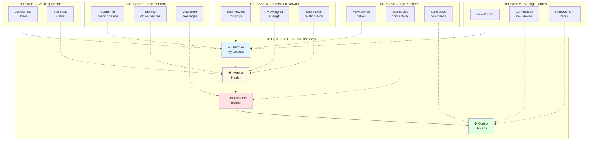
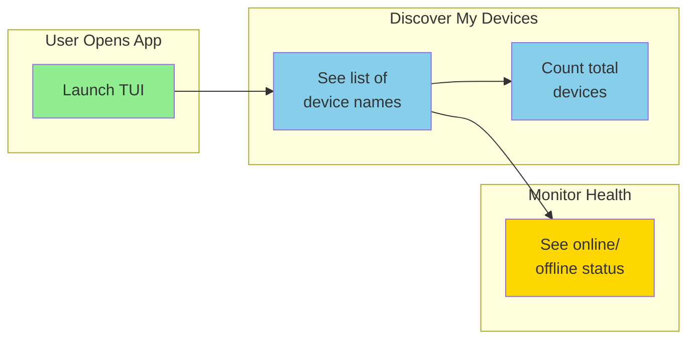
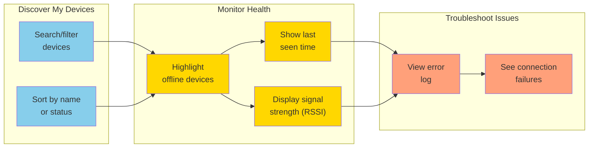
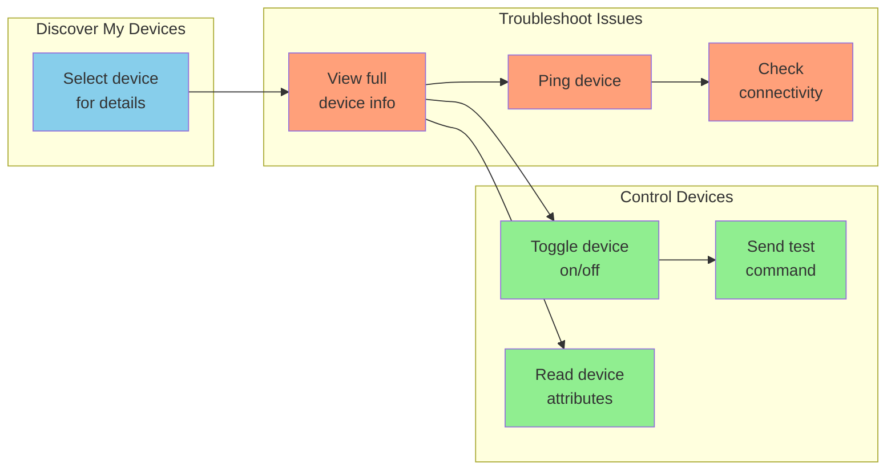
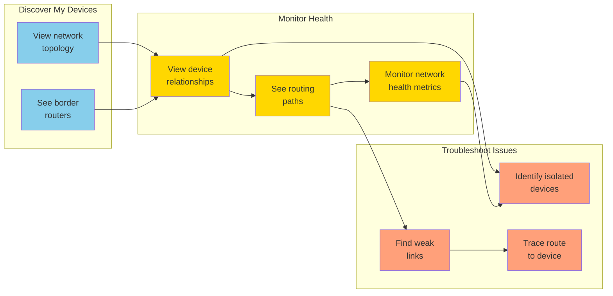
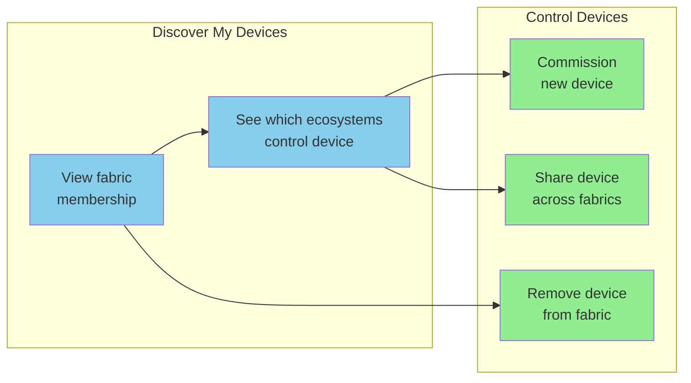
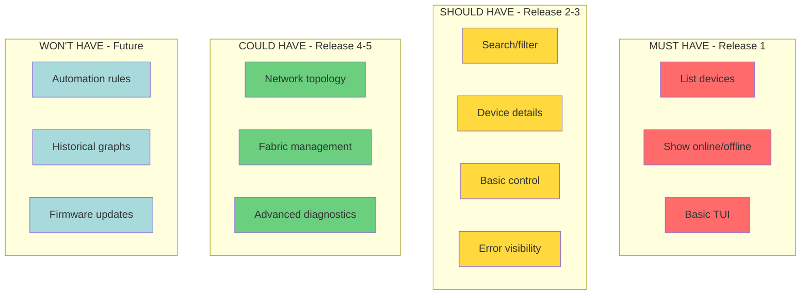

# Matter/Thread TUI - Story Map

## User Story
**As a** Matter/Thread network owner
**I need to** see and manage my devices
**So that** I can understand what's happening and fix problems

---

## Overall Story Map - User Journey Backbone



---

## Release 1: Walking Skeleton
**Value: "Can I see what devices I have?"**

### The Simplest Thing That Could Possibly Work



**User Stories:**
1. ✅ See a list of my device names
2. ✅ Know how many devices I have
3. ✅ See which devices are online/offline

**Implementation:**
- Single view: Device list
- Connect to python-matter-server
- Display: Name | Type | Status
- No navigation, no details, no controls

**Done When:**
- I launch the app
- I see my devices listed
- I can tell what's online

---

## Release 2: See Problems
**Value: "Can I identify what's broken?"**



**User Stories:**
1. ✅ Find a specific device quickly
2. ✅ See which devices are offline
3. ✅ Know when device was last seen
4. ✅ See signal strength problems
5. ✅ View recent errors

**Added to Release 1:**
- Search box
- Sort toggle
- RSSI column
- "Last Seen" timestamp
- Simple log viewer (bottom panel)
- Color coding (green=online, red=offline, yellow=weak signal)

**Done When:**
- I can type to search
- Offline devices stand out visually
- I can see the error log
- I know which device has weak signal

---

## Release 3: Fix Problems
**Value: "Can I take action on issues?"**



**User Stories:**
1. ✅ Select a device to see details
2. ✅ View all device attributes
3. ✅ Ping a device to test connectivity
4. ✅ Turn a device on/off
5. ✅ Send a simple command

**Added to Release 2:**
- Device detail panel (press Enter on device)
- Attributes viewer
- Ping tool (keyboard shortcut 'p')
- Basic controls (for lights/switches)
- Command result feedback

**Done When:**
- I can click/select a device
- I see manufacturer, model, capabilities
- I can ping to test connection
- I can turn my light on/off
- I know if command succeeded

---

## Release 4: Understand Network
**Value: "Can I see how devices connect?"**



**User Stories:**
1. ✅ See Thread network topology
2. ✅ Identify border routers
3. ✅ Understand parent-child relationships
4. ✅ Find routing paths
5. ✅ See network health statistics
6. ✅ Identify weak signal paths

**Added to Release 3:**
- Network view tab
- Topology visualization
- Border router highlighting
- Network stats panel
- Route tracing tool

**Done When:**
- I can switch to Network tab
- I see a visual graph of connections
- Border routers are clearly marked
- I can see which devices are routers vs. sleepy end devices
- I can trace path from border router to device

---

## Release 5: Manage Fabrics
**Value: "Can I manage device sharing?"**



**User Stories:**
1. ✅ See which fabrics control each device
2. ✅ View all fabrics (Apple Home, Google Home, etc.)
3. ✅ Commission a new device
4. ✅ Remove device from a fabric
5. ✅ See fabric overlap

**Added to Release 4:**
- Fabrics view tab
- Fabric tree view
- Commission wizard
- Remove from fabric action
- Fabric details panel

**Done When:**
- I can see all my fabrics
- I know which devices are shared
- I can add a new device via setup code
- I can remove a device from specific fabric
- I understand fabric relationships

---

## Priority Matrix



---

## Implementation Sequence (Simplest First)

### Sprint 1: Walking Skeleton (Release 1)
**Goal: See my devices - that's it!**

```
Day 1-2: Basic Textual app with one screen
Day 3-4: Connect to python-matter-server
Day 5-6: Display device list with status
Day 7: Polish and test
```

**Demo:** "Look, here are my 12 devices, 10 online, 2 offline"

### Sprint 2: Visibility (Release 2)
**Goal: Find problems fast**

```
Day 1-2: Add search and sort
Day 3-4: Add RSSI and last-seen
Day 5-6: Add log viewer
Day 7: Color coding and polish
```

**Demo:** "I can instantly see my bedroom bulb is offline with weak signal"

### Sprint 3: Action (Release 3)
**Goal: Fix what's broken**

```
Day 1-2: Device detail panel
Day 3-4: Ping tool
Day 5-6: Basic device controls
Day 7: Command feedback
```

**Demo:** "I can ping the device, see it's reachable, and turn it on"

### Sprint 4: Understanding (Release 4)
**Goal: See the network structure**

```
Day 1-3: Thread network integration
Day 4-6: Topology visualization
Day 7: Network statistics
```

**Demo:** "I can see my 2 HomePod border routers and how devices connect"

### Sprint 5: Management (Release 5)
**Goal: Control fabrics**

```
Day 1-3: Fabric view
Day 4-6: Commission workflow
Day 7: Remove from fabric
```

**Demo:** "I can add a new device and share it across ecosystems"

---

## Value Per Release

| Release | User Value | Effort | ROI |
|---------|-----------|--------|-----|
| R1: Walking Skeleton | Can see what I have | 1 week | ⭐⭐⭐⭐⭐ |
| R2: See Problems | Can identify issues | 1 week | ⭐⭐⭐⭐⭐ |
| R3: Fix Problems | Can take action | 1 week | ⭐⭐⭐⭐ |
| R4: Network View | Can understand topology | 2 weeks | ⭐⭐⭐ |
| R5: Fabric Mgmt | Can manage sharing | 1 week | ⭐⭐⭐ |

**Key Insight:** Releases 1-3 deliver 80% of the value in 3 weeks. That's the target.
